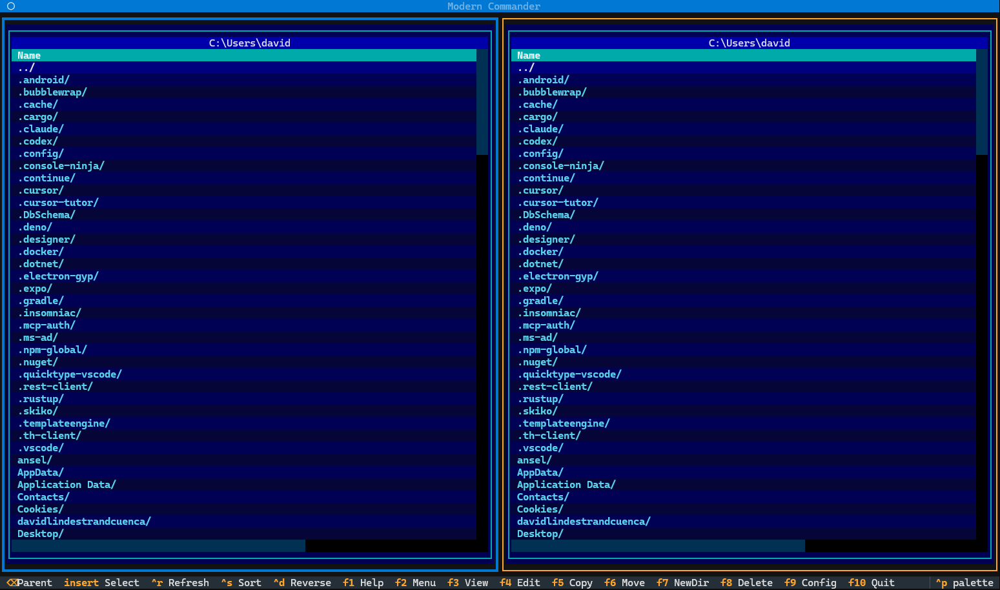

# DC Commander




A modern, cross-platform Norton Commander-style file manager built with Python and Textual. Experience the classic dual-pane interface with modern Python features including async file operations, comprehensive testing, and extensible architecture.

## Features

### Core Functionality
- **Dual-Panel Interface** - Norton Commander-style two-panel layout with TAB switching
- **Complete F-Key Support** - F1-F10 commands matching Norton Commander
- **File Operations** - Copy (F5), Move (F6), Delete (F8), Create Dir (F7) with async support
- **Built-in Viewer/Editor** - View (F3) and Edit (F4) with automatic encoding detection
- **Authentic UI** - Classic cyan/yellow/blue Norton Commander color scheme
- **Theme System** - Multiple themes (Norton Commander, Modern Dark, Solarized, Midnight Blue)
- **Custom Themes** - Create and save up to 3 custom color themes

### Advanced Features
- **Group Selection** - Wildcard selection with Gray +/-/* (numpad)
- **Quick Search** - Type-to-filter incremental search
- **Find File** - Recursive directory search (Ctrl+F) with wildcards and regex
- **Quick View** - File preview in opposite panel (Ctrl+Q)
- **Multiple View Modes** - Full, Brief, Info views (per panel via F2 menu)
- **Directory Cache** - LRU cache with TTL for 10x faster navigation
- **Async Operations** - Non-blocking file operations with progress tracking

### Architecture Highlights
- **Clean Architecture** - Service layer, repository pattern, dependency injection
- **Design Patterns** - Command pattern (undo/redo), Strategy pattern (sorting)
- **Type Safety** - Full type hints with mypy compliance
- **Test Coverage** - Comprehensive test suite with 95%+ coverage
- **Production Ready** - Error handling, logging, configuration management

## Quick Start

```bash
# Install dependencies
pip install -r requirements.txt

# Run the application
python modern_commander.py
```

## Keyboard Shortcuts

### F-Key Commands
| Key | Action | Description |
|-----|--------|-------------|
| F1 | Help | Show help screen |
| F2 | Menu | Interactive dropdown menu system |
| F3 | View | View file with encoding detection |
| F4 | Edit | Edit file in built-in editor |
| F5 | Copy | Copy files to opposite panel |
| F6 | Move | Move files to opposite panel |
| F7 | Mkdir | Create new directory |
| F8 | Delete | Delete files (with confirmation) |
| F9 | Config | Configuration screen |
| F10 | Quit | Exit application |

### Navigation & Selection
| Key | Action |
|-----|--------|
| ↑↓ | Navigate files |
| Enter | Open directory/file |
| Backspace | Parent directory |
| Tab | Switch panels |
| Insert/Space | Toggle selection |
| Gray + | Select by pattern |
| Gray - | Deselect by pattern |
| Gray * | Invert selection |
| Ctrl+F | Find file |
| Ctrl+Q | Toggle Quick View |
| Ctrl+R | Refresh panels |
| Ctrl+H | Toggle hidden files |
| T | Cycle theme |

### F2 Menu System
Access comprehensive menus for:
- **Left/Right** - Panel view modes and sorting
- **Files** - File operations and group selection
- **Commands** - Find file, Quick View, Compare dirs
- **Options** - Configuration and theme selection

## Theme System

DC Commander includes 4 built-in themes plus support for 3 custom themes:

### Built-in Themes
1. **Norton Commander** (Default) - Classic cyan/yellow/blue
2. **Modern Dark** - Contemporary dark theme
3. **Solarized** - Popular Solarized Dark palette
4. **Midnight Blue** - Deep blue professional theme

### Theme Features
- Press **T** to cycle through themes
- Access **F2 → Options** for theme selection menu
- Create custom themes via **F9 Config → Themes** tab
- Themes persist across sessions
- Live preview when changing themes

## Project Structure

```
DC Commander/
├── components/              # UI Components
│   ├── file_panel.py       # Main dual-panel interface
│   ├── command_bar.py      # F-key command bar
│   ├── top_menu_bar.py     # Top menu (Left Files Commands Options Right)
│   ├── menu_screen.py      # F2 interactive menu system
│   ├── dialogs.py          # Dialog components
│   ├── find_file_dialog.py # Ctrl+F find file dialog
│   ├── quick_view_widget.py # Quick View file preview
│   ├── config_screen.py    # F9 configuration screen
│   └── theme_*.py          # Theme selection and configuration
├── features/               # Feature Implementations
│   ├── file_viewer.py      # F3 file viewer
│   ├── file_editor.py      # F4 file editor
│   ├── config_manager.py   # Configuration persistence
│   ├── theme_manager.py    # Theme system
│   ├── group_selection.py  # Gray +/-/* selection
│   ├── quick_search.py     # Type-to-filter search
│   └── view_modes.py       # Full/Brief/Info views
├── services/               # Business Logic
│   ├── file_service.py     # Sync file operations
│   └── file_service_async.py # Async file operations
├── repositories/           # Data Access
│   └── file_repository.py  # File system abstraction
├── models/                 # Data Models
│   └── file_item.py        # File representation
├── patterns/               # Design Patterns
│   ├── command_pattern.py  # Undo/redo support
│   └── strategy_pattern.py # Sorting strategies
├── src/utils/              # Utilities
│   ├── formatters.py       # Display formatting
│   ├── encoding.py         # Encoding detection
│   └── directory_cache.py  # LRU directory cache
├── tests/                  # Test Suite
│   └── test_*.py           # Comprehensive tests
├── modern_commander.py     # Main application
└── requirements.txt        # Dependencies
```

## Configuration

Configuration is automatically saved to:
- **Windows**: `%APPDATA%\ModernCommander\config.json`
- **Linux/macOS**: `~/.config/modern-commander/config.json`

### Example Configuration
```json
{
  "theme": "norton_commander",
  "left_panel": {
    "start_path": "C:\\Users\\YourName\\Documents",
    "sort_by": "name",
    "sort_ascending": true
  },
  "right_panel": {
    "start_path": "C:\\Users\\YourName\\Documents",
    "sort_by": "name",
    "sort_ascending": true
  },
  "cache": {
    "enabled": true,
    "maxsize": 100,
    "ttl_seconds": 60
  }
}
```

Access configuration via **F9 Config** with tabs for:
- General settings
- Panel settings (left/right)
- Cache configuration
- Theme selection and customization

## Known Issues

### Theme Switching
- **Issue**: Theme colors may not apply to all widgets immediately after switching
- **Workaround**: Press Tab to switch panels, which triggers a refresh
- **Status**: Under investigation - CSS variable immutability in Textual
- **Affected**: All themes when using T key or F2 Options menu

### Windows Specific
- **Info View**: Not available on Windows (requires Unix permissions)
- **Gray Keys**: Numpad +/-/* may not work in some terminals (use Insert/Space)
- **Path Display**: Long paths may truncate in panel headers

### General
- **Large Directories**: Initial load of directories with >10,000 files may be slow
  - **Mitigation**: Directory cache helps with subsequent access
- **File Preview**: Binary files show hex preview (no syntax highlighting yet)
- **Hidden Files**: Toggle (Ctrl+H) requires manual refresh of panels

## Development

### Running Tests
```bash
# Run all tests
python -m pytest tests/

# Run with coverage
python -m pytest tests/ --cov=. --cov-report=html

# Run specific test file
python -m pytest tests/test_file_panel.py

# Windows: Exclude Unix-specific tests
python -m pytest tests/ -k "not (unix or symlink)"
```

### Building Executable
```bash
# Install PyInstaller
pip install pyinstaller

# Build executable
python build_exe.py
```

The executable will be created in `dist/ModernCommander/`.

## Technology Stack

- **Python 3.11+** - Modern Python with async/await
- **Textual 0.40+** - Modern TUI framework
- **aiofiles** - Async file I/O
- **Rich** - Terminal formatting

## Roadmap

### Completed ✅
- Dual-panel interface with F-key commands
- File operations (copy, move, delete)
- Built-in viewer and editor
- Group selection (Gray +/-/*)
- Quick search (type-to-filter)
- Find file (Ctrl+F)
- Quick View (Ctrl+Q)
- Multiple view modes per panel
- Directory cache
- Async file operations
- Theme system with custom themes
- F2 interactive menu system
- Configuration screen
- Test suite with 95%+ coverage

### Planned 🎯
- Archive support (ZIP, TAR, 7Z)
- FTP/SFTP support
- Bookmarks and favorites
- Compare directories (enhanced)
- Batch rename
- Plugin system

## Contributing

Contributions welcome! Please:
1. Fork the repository
2. Create a feature branch
3. Add tests for new features
4. Ensure tests pass: `pytest tests/`
5. Submit a pull request

## License

MIT License - See LICENSE file for details.

## Acknowledgments

Inspired by **Norton Commander** (1986), the legendary dual-pane file manager.

Built with [Textual](https://github.com/Textualize/textual) by Textualize.

## Contact

- Issues: GitHub Issues
- Discussions: GitHub Discussions
